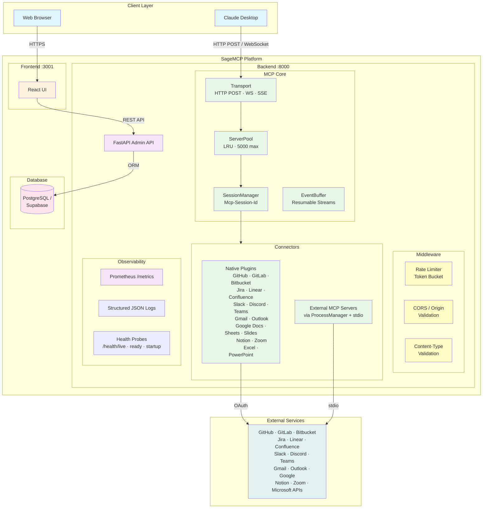

<div align="center">
  <h1>Sage MCP</h1>
  <p>
    <strong>Multi-Tenant MCP Server Platform</strong>
  </p>
  <p>
    A scalable platform for hosting MCP (Model Context Protocol) servers with OAuth/API key integration and connector plugins.
  </p>

  [](https://opensource.org/licenses/Apache-2.0)
  [](https://www.python.org/downloads/)
  [](https://www.docker.com/)
  [](https://github.com/mvmcode/SageMCP/actions)
  [](https://discord.gg/f5RrQ6aGCS)
</div>

## About The Project

Sage MCP is a production-ready platform that enables you to run multiple isolated MCP servers with built-in OAuth/API key authentication for 23+ services. It provides a web interface and CLI for managing tenants and connectors, making it easy to integrate Claude Desktop with various external services.

**Key Features:**
- Multi-tenant architecture with path-based isolation
- Full MCP protocol support (Streamable HTTP, WebSocket, SSE) with protocol version negotiation
- Server pooling with LRU eviction (5,000 max instances, 30-min TTL)
- Session management via `Mcp-Session-Id` with resumable SSE streams
- Token-bucket rate limiting (configurable RPM per tenant)
- External MCP server hosting via stdio subprocess (`GenericMCPConnector`)
- OAuth 2.0 integration with tenant-level and user-level tokens
- Field-level encryption at rest (Fernet/AES) and API key authentication
- Prometheus metrics, structured JSON logging, and Kubernetes health probes
- Progressive rollout via feature flags (`SAGEMCP_ENABLE_*`)

## Screenshots

<div align="center">
  
  <p><em>Manage 19+ native connectors with OAuth integration</em></p>
  
  <p><em>Fine-grained tool enable/disable per connector</em></p>
  
  <p><em>Built-in MCP protocol testing with WebSocket and HTTP support</em></p>
</div>

## Supported Connectors

> **340 tools** across 23 native connectors, plus unlimited external MCP server support.

<div align="center">
<table>
<tr><th colspan="6">Code & Version Control</th></tr>
<tr>
  <td align="center"><a href="docs/connectors/github.md"></a></td>
  <td align="center"><a href="docs/connectors/gitlab.md"></a></td>
  <td align="center"><a href="docs/connectors/bitbucket.md"></a></td>
  <td></td><td></td><td></td>
</tr>
<tr><th colspan="6">Project Management</th></tr>
<tr>
  <td align="center"><a href="docs/connectors/jira.md"></a></td>
  <td align="center"><a href="docs/connectors/linear.md"></a></td>
  <td align="center"><a href="docs/connectors/confluence.md"></a></td>
  <td></td><td></td><td></td>
</tr>
<tr><th colspan="6">Communication</th></tr>
<tr>
  <td align="center"><a href="docs/connectors/slack.md"></a></td>
  <td align="center"><a href="docs/connectors/discord.md"></a></td>
  <td align="center"><a href="docs/connectors/teams.md"></a></td>
  <td></td><td></td><td></td>
</tr>
<tr><th colspan="6">Email</th></tr>
<tr>
  <td align="center"><a href="docs/connectors/gmail.md"></a></td>
  <td align="center"><a href="docs/connectors/outlook.md"></a></td>
  <td></td><td></td><td></td><td></td>
</tr>
<tr><th colspan="6">Documents & Productivity</th></tr>
<tr>
  <td align="center"><a href="docs/connectors/google-docs.md"></a></td>
  <td align="center"><a href="docs/connectors/google-sheets.md"></a></td>
  <td align="center"><a href="docs/connectors/google-slides.md"></a></td>
  <td align="center"><a href="docs/connectors/notion.md"></a></td>
  <td align="center"><a href="docs/connectors/excel.md"></a></td>
  <td align="center"><a href="docs/connectors/powerpoint.md"></a></td>
</tr>
<tr>
  <td align="center"><a href="docs/connectors/zoom.md"></a></td>
  <td></td><td></td><td></td><td></td><td></td>
</tr>
<tr><th colspan="6">AI Coding Tool Intelligence</th></tr>
<tr>
  <td align="center"><a href="docs/connectors/copilot.md"></a></td>
  <td align="center"><a href="docs/connectors/claude-code.md"></a></td>
  <td align="center"><a href="docs/connectors/codex.md"></a></td>
  <td align="center"><a href="docs/connectors/cursor.md"></a></td>
  <td align="center"><a href="docs/connectors/windsurf.md"></a></td>
  <td></td>
</tr>
</table>
</div>

## Architecture

<div align="center">

### High-Level System Architecture



**[View Full Architecture Documentation](docs/architecture.md)** | Includes 10+ detailed diagrams covering OAuth flows, multi-tenancy, database schema, deployment, and more.

</div>

### Built With

[](https://fastapi.tiangolo.com/)
[](https://reactjs.org/)
[](https://www.sqlalchemy.org/)
[](https://modelcontextprotocol.io/)
[](https://prometheus.io/)
[](https://www.docker.com/)

## Security

- **Encryption at rest** -- All OAuth tokens, API keys, and connector credentials encrypted via Fernet (AES-128-CBC + HMAC), key derived from `SECRET_KEY` via PBKDF2-SHA256 (480K iterations).
- **API key authentication** -- Three scope tiers (`platform_admin`, `tenant_admin`, `tenant_user`) with bcrypt-hashed storage and SHA-256 LRU cache. Feature-flagged via `SAGEMCP_ENABLE_AUTH`.
- **Transport security** -- CORS origin validation, Content-Type enforcement, per-tenant token-bucket rate limiting.

## Getting Started

### Prerequisites

- Docker and Docker Compose
- Python 3.11+ (for local development)
- PostgreSQL or Supabase account

### Installation

1. **Clone the repository**
   ```bash
   git clone https://github.com/mvmcode/SageMCP.git
   cd SageMCP
   ```

2. **Setup environment**
   ```bash
   cp .env.example .env
   # Edit .env with your OAuth credentials (optional for testing)
   ```

3. **Start the platform**
   ```bash
   make setup
   make up
   ```

4. **Access the application**
   - Frontend: http://localhost:3001
   - API: http://localhost:8000
   - API Docs: http://localhost:8000/docs
   - Metrics: http://localhost:8000/metrics (when `SAGEMCP_ENABLE_METRICS=true`)
   - Health: http://localhost:8000/health/live | `/health/ready` | `/health/startup`

## Usage

### Management Options

SageMCP provides two ways to manage your platform:

1. **Web Interface** - Visual interface at http://localhost:3001
2. **Command-Line Interface (CLI)** - Powerful CLI for automation and DevOps

### Quick Start (Web Interface)

1. Open the web interface at http://localhost:3001
2. Create a new tenant
3. Add a connector (e.g., GitHub) and configure OAuth
4. Copy the MCP server URL for Claude Desktop

### Quick Start (CLI)

```bash
# Install CLI
pip install -e ".[cli]"

# Initialize configuration
sagemcp init

# Create a tenant
sagemcp tenant create --slug my-tenant --name "My Tenant"

# Add a connector
sagemcp connector create my-tenant --type github --name "GitHub"

# Configure OAuth (opens browser)
sagemcp oauth authorize my-tenant github

# Test MCP tools
sagemcp mcp tools my-tenant <connector-id>

# Interactive REPL
sagemcp mcp interactive my-tenant <connector-id>
```

**[Full CLI Documentation](src/sage_mcp/cli/README.md)** | **[CLI Design Document](docs/cli-design.md)**

### Claude Desktop Configuration

Add to your Claude Desktop config:

```json
{
  "mcpServers": {
    "sage-mcp": {
      "command": "npx",
      "args": ["-y", "@modelcontextprotocol/server-everything"],
      "env": {
        "MCP_SERVER_URL": "ws://localhost:8000/api/v1/{tenant-slug}/mcp"
      }
    }
  }
}
```

### User-Level OAuth Tokens

SageMCP supports per-user OAuth tokens in addition to tenant-level credentials. See **[User-Level OAuth Tokens](docs/user-oauth-tokens.md)** for HTTP and WebSocket examples.

## Feature Flags & Configuration

SageMCP uses feature flags for progressive rollout of v2 capabilities. All flags default to `false` and can be enabled via environment variables.

| Flag | Description | Default |
|------|-------------|---------|
| `SAGEMCP_ENABLE_SERVER_POOL` | LRU server-instance pool (5,000 max, 30-min TTL) | `false` |
| `SAGEMCP_ENABLE_SESSION_MANAGEMENT` | `Mcp-Session-Id` tracking and SSE replay | `false` |
| `SAGEMCP_ENABLE_METRICS` | Prometheus `/metrics` endpoint | `false` |
| `SAGEMCP_ENABLE_AUTH` | API key authentication and authorization | `false` |

Additional configuration settings:

| Setting | Description | Default |
|---------|-------------|---------|
| `SECRET_KEY` | Key for Fernet encryption and token signing (min 16 chars) | *required* |
| `RATE_LIMIT_RPM` | Requests per minute per tenant (token bucket) | `100` |
| `CORS_ALLOWED_ORIGINS` | Comma-separated allowed CORS origins | `*` (dev) |
| `MCP_ALLOWED_ORIGINS` | Comma-separated allowed MCP `Origin` headers | -- |
| `SAGEMCP_BOOTSTRAP_ADMIN_KEY` | One-time bootstrap key to create first platform admin | -- |

## Development

### Running Tests

```bash
# Backend tests
make test-backend

# Frontend tests
make test-frontend

# All tests with coverage
make test-coverage
```

### Available Commands

```bash
make help            # Show all available commands
make build           # Build Docker images
make up              # Start all services
make down            # Stop all services
make logs            # View logs
make shell           # Open shell in app container
make clean           # Clean up containers and volumes
```

### Adding New Connectors

1. Create a new connector class in `src/sage_mcp/connectors/`
2. Implement the `BaseConnector` interface
3. Register with `@register_connector` decorator
4. Add to the connector enum

See existing connectors in `src/sage_mcp/connectors/` for examples.

## Deployment

### Docker Compose (Development)
```bash
make up
```

### Kubernetes (Production)

Deploy with PostgreSQL:
```bash
helm install sage-mcp ./helm
```

Deploy with Supabase:
```bash
helm install sage-mcp ./helm \
  --set database.provider=supabase \
  --set postgresql.enabled=false \
  --set supabase.url=https://your-project.supabase.co \
  --set supabase.serviceRoleKey=your-service-role-key
```

## Roadmap

- [ ] Tool policy language (per-connector tool enable/disable rules)
- [ ] OpenTelemetry tracing
- [ ] Redis-backed session persistence

See the [open issues](https://github.com/mvmcode/SageMCP/issues) for a full list of proposed features and known issues.

## Contributing

Contributions are what make the open source community amazing! Any contributions you make are **greatly appreciated**.

1. Fork the Project
2. Create your Feature Branch (`git checkout -b feature/AmazingFeature`)
3. Commit your Changes (`git commit -m 'Add some AmazingFeature'`)
4. Push to the Branch (`git push origin feature/AmazingFeature`)
5. Open a Pull Request

## License

Distributed under the Apache 2.0 License. See `LICENSE` for more information.

## Contact

- Project Link: [https://github.com/mvmcode/SageMCP](https://github.com/mvmcode/SageMCP)
- Discord Community: [https://discord.gg/f5RrQ6aGCS](https://discord.gg/f5RrQ6aGCS)

## Acknowledgments

* [Model Context Protocol](https://modelcontextprotocol.io/)
* [FastAPI](https://fastapi.tiangolo.com/)
* [Claude Desktop](https://claude.ai/)
* [Best-README-Template](https://github.com/othneildrew/Best-README-Template)

---

<div align="center">
  Built with FastAPI, React, and the MCP Protocol
</div>
