<div align="center">
  <h1>Sage MCP</h1>
  <p>
    <strong>Multi-Tenant MCP Server Platform</strong>
  </p>
  <p>
    A scalable platform for hosting MCP (Model Context Protocol) servers with OAuth/API key integration and connector plugins.
  </p>

  [](https://opensource.org/licenses/Apache-2.0)
  [](https://www.python.org/downloads/)
  [](https://www.docker.com/)
  [](https://github.com/mvmcode/SageMCP/actions)
</div>

## About The Project

Sage MCP is a production-ready platform that enables you to run multiple isolated MCP servers with built-in OAuth/API key authentication for 23+ services including GitHub, GitLab, Bitbucket, Jira, Linear, Confluence, Slack, Discord, Teams, Gmail, Outlook, Google Docs/Sheets/Slides, Notion, Excel, PowerPoint, Zoom, and AI coding tool intelligence connectors (GitHub Copilot, Claude Code, OpenAI Codex, Cursor, Windsurf). It provides a web interface for managing tenants and connectors, making it easy to integrate Claude Desktop with various external services.

**Key Features:**
- Multi-tenant architecture with path-based isolation
- Full MCP protocol support (Streamable HTTP, WebSocket, SSE) with protocol version negotiation
- Server pooling with LRU eviction (5,000 max instances, 30-min TTL)
- Session management via `Mcp-Session-Id` with resumable SSE streams
- Token-bucket rate limiting (configurable RPM per tenant)
- External MCP server hosting via stdio subprocess (`GenericMCPConnector`)
- OAuth 2.0 integration with tenant-level and user-level tokens
- Prometheus metrics, structured JSON logging, and Kubernetes health probes
- Progressive rollout via feature flags (`SAGEMCP_ENABLE_*`)

## Screenshots

<div align="center">
  
  <p><em>Manage 19+ native connectors with OAuth integration</em></p>
  
  <p><em>Fine-grained tool enable/disable per connector</em></p>
  
  <p><em>Built-in MCP protocol testing with WebSocket and HTTP support</em></p>
</div>

## Architecture

<div align="center">

### High-Level System Architecture

```mermaid
graph TB
    subgraph Client["Client Layer"]
        CD[Claude Desktop]
        WEB[Web Browser]
    end

    subgraph Platform["SageMCP Platform"]
        subgraph Frontend["Frontend :3001"]
            UI[React UI]
        end

        subgraph Backend["Backend :8000"]
            subgraph Middleware["Middleware"]
                RL["Rate Limiter
                Token Bucket"]
                CORS_MW["CORS / Origin
                Validation"]
                CT["Content-Type
                Validation"]
            end

            API[FastAPI Admin API]

            subgraph MCPCore["MCP Core"]
                POOL["ServerPool
                LRU · 5000 max"]
                SESS["SessionManager
                Mcp-Session-Id"]
                TRANSPORT["Transport
                HTTP POST · WS · SSE"]
                EBUF["EventBuffer
                Resumable Streams"]
            end

            subgraph Connectors["Connectors"]
                NATIVE["Native Plugins
                GitHub · GitLab · Bitbucket
                Jira · Linear · Confluence
                Slack · Discord · Teams
                Gmail · Outlook
                Google Docs · Sheets · Slides
                Notion · Zoom
                Excel · PowerPoint"]
                EXT_MCP["External MCP Servers
                via ProcessManager + stdio"]
            end

            subgraph Observability["Observability"]
                PROM["Prometheus /metrics"]
                LOGS["Structured JSON Logs"]
                HEALTH["Health Probes
                /health/live · ready · startup"]
            end
        end

        subgraph Database["Database"]
            DB[("PostgreSQL /
            Supabase")]
        end
    end

    subgraph External["External Services"]
        EXT["GitHub · GitLab · Bitbucket
        Jira · Linear · Confluence
        Slack · Discord · Teams
        Gmail · Outlook · Google
        Notion · Zoom · Microsoft APIs"]
    end

    CD -->|"HTTP POST / WebSocket"| TRANSPORT
    WEB -->|HTTPS| UI
    UI -->|REST API| API
    TRANSPORT --> POOL
    POOL --> SESS
    SESS --> Connectors
    NATIVE -->|OAuth| EXT
    EXT_MCP -->|stdio| EXT
    API -->|ORM| DB

    style CD fill:#e1f5ff
    style WEB fill:#e1f5ff
    style UI fill:#fff3e0
    style API fill:#f3e5f5
    style POOL fill:#e8f5e9
    style SESS fill:#e8f5e9
    style TRANSPORT fill:#e8f5e9
    style EBUF fill:#e8f5e9
    style NATIVE fill:#e8f5e9
    style EXT_MCP fill:#e8f5e9
    style DB fill:#fce4ec
    style EXT fill:#e0f2f1
    style RL fill:#fff9c4
    style CORS_MW fill:#fff9c4
    style CT fill:#fff9c4
    style PROM fill:#f3e5f5
```



**[📖 View Full Architecture Documentation →](docs/architecture.md)** | Includes 10+ detailed diagrams covering OAuth flows, multi-tenancy, database schema, deployment, and more.

</div>

**Architecture Highlights:**
- **Server pooling** — LRU-evicted pool (5,000 max, 30-min TTL) caches `MCPServer` instances per tenant+connector
- **Session management** — `Mcp-Session-Id` header tracks sessions; `EventBuffer` ring buffer enables SSE replay via `Last-Event-ID`
- **Rate limiting** — per-tenant token-bucket rate limiter (default 100 RPM, configurable)
- **External MCP hosting** — `MCPProcessManager` runs third-party MCP servers (Python/Node.js/Go) as stdio subprocesses with health checks and auto-restart
- **Observability** — 11 Prometheus metrics (histograms, counters, gauges), structured JSON logging, `/health/live|ready|startup` probes
- **Feature flags** — `SAGEMCP_ENABLE_SERVER_POOL`, `SAGEMCP_ENABLE_SESSION_MANAGEMENT`, `SAGEMCP_ENABLE_METRICS` for progressive rollout

### Built With

* [FastAPI](https://fastapi.tiangolo.com/) - Backend framework
* [React](https://reactjs.org/) - Frontend interface
* [SQLAlchemy](https://www.sqlalchemy.org/) - Database ORM
* [MCP](https://modelcontextprotocol.io/) - Model Context Protocol
* [prometheus-client](https://github.com/prometheus/client_python) - Metrics instrumentation
* [Docker](https://www.docker.com/) - Containerization

## Getting Started

### Prerequisites

- Docker and Docker Compose
- Python 3.11+ (for local development)
- PostgreSQL or Supabase account

### Installation

1. **Clone the repository**
   ```bash
   git clone https://github.com/mvmcode/SageMCP.git
   cd SageMCP
   ```

2. **Setup environment**
   ```bash
   cp .env.example .env
   # Edit .env with your OAuth credentials (optional for testing)
   ```

3. **Start the platform**
   ```bash
   make setup
   make up
   ```

4. **Access the application**
   - Frontend: http://localhost:3001
   - API: http://localhost:8000
   - API Docs: http://localhost:8000/docs
   - Metrics: http://localhost:8000/metrics (when `SAGEMCP_ENABLE_METRICS=true`)
   - Health: http://localhost:8000/health/live | `/health/ready` | `/health/startup`

## Usage

### Management Options

SageMCP provides two ways to manage your platform:

1. **Web Interface** - Visual interface at http://localhost:3001
2. **Command-Line Interface (CLI)** - Powerful CLI for automation and DevOps

### Quick Start (Web Interface)

1. Open the web interface at http://localhost:3001
2. Create a new tenant
3. Add a connector (e.g., GitHub) and configure OAuth
4. Copy the MCP server URL for Claude Desktop

### Quick Start (CLI)

```bash
# Install CLI
pip install -e ".[cli]"

# Initialize configuration
sagemcp init

# Create a tenant
sagemcp tenant create --slug my-tenant --name "My Tenant"

# Add a connector
sagemcp connector create my-tenant --type github --name "GitHub"

# Configure OAuth (opens browser)
sagemcp oauth authorize my-tenant github

# Test MCP tools
sagemcp mcp tools my-tenant <connector-id>
```

**[📖 Full CLI Documentation →](src/sage_mcp/cli/README.md)**

### Claude Desktop Configuration

Add to your Claude Desktop config:

```json
{
  "mcpServers": {
    "sage-mcp": {
      "command": "npx",
      "args": ["-y", "@modelcontextprotocol/server-everything"],
      "env": {
        "MCP_SERVER_URL": "ws://localhost:8000/api/v1/{tenant-slug}/mcp"
      }
    }
  }
}
```

### Supported Connectors

Sage MCP provides production-ready connectors for popular development and collaboration tools. Each connector includes full OAuth 2.0 integration and comprehensive tool coverage.

### User-Level OAuth Tokens

SageMCP supports both **tenant-level** and **user-level** OAuth authentication:

- **Tenant-level OAuth** (default): Single OAuth credential shared by all users in a tenant
- **User-level OAuth**: Each user passes their own OAuth token per request

**HTTP POST requests** (use custom header):
```bash
curl -X POST http://localhost:8000/api/v1/{tenant-slug}/connectors/{connector-id}/mcp \
  -H "X-User-OAuth-Token: <user-oauth-token>" \
  -H "Content-Type: application/json" \
  -H "Accept: application/json, text/event-stream" \
  -d '{"jsonrpc":"2.0","id":1,"method":"tools/list","params":{}}'
```

**WebSocket connections** (use extension message):
```javascript
const ws = new WebSocket('ws://localhost:8000/api/v1/{tenant-slug}/connectors/{connector-id}/mcp');

ws.onopen = () => {
  // Set user token before initialize
  ws.send(JSON.stringify({
    jsonrpc: '2.0',
    method: 'auth/setUserToken',
    params: { token: '<user-oauth-token>' }
  }));

  // Then proceed with normal MCP flow
  ws.send(JSON.stringify({
    jsonrpc: '2.0',
    id: 1,
    method: 'initialize',
    params: { protocolVersion: '2025-06-18' }  // also supports '2024-11-05'
  }));
};
```

**Priority**: User token (if provided) → Tenant credential (fallback)

**Use cases:**
- Multi-user SaaS apps where each user needs their own OAuth identity
- Testing with different user accounts
- Per-user access control and audit trails

**Note**: User tokens are for external APIs (GitHub, Slack, etc.), separate from MCP protocol-level authentication.

<div align="left">

**Code & Version Control**

####  GitHub
**24 tools** for complete repository management
- Repositories, issues, pull requests, and releases
- Commits, branches, and comparisons
- GitHub Actions workflows and runs
- User and organization management
- [Full Documentation →](docs/connectors/github.md)

#### GitLab
**22 tools** for GitLab project management
- Projects, merge requests, issues, and pipelines
- Branches, commits, and repository tree
- Groups, milestones, labels, and MR discussions
- Supports gitlab.com and self-hosted instances
- [Full Documentation →](docs/connectors/gitlab.md)

#### Bitbucket
**19 tools** for Bitbucket Cloud
- Repositories, pull requests, and issues
- Pipelines, branches, commits, and diffs
- Workspaces and workspace members
- File content retrieval
- [Full Documentation →](docs/connectors/bitbucket.md)

**Project Management**

####  Jira
**20 tools** for agile project management
- Issue creation, updates, and JQL search
- Sprint and board management
- Workflow transitions and comments
- Project and version tracking
- [Full Documentation →](docs/connectors/jira.md)

#### Linear
**18 tools** for modern issue tracking
- Issues, projects, teams, and cycles
- Labels, workflow states, and comments
- Full-text search and GraphQL API
- Relay-style cursor pagination
- [Full Documentation →](docs/connectors/linear.md)

#### Confluence
**16 tools** for knowledge management
- Spaces, pages, and CQL content search
- Comments, labels, and version history
- Page creation, update, and deletion
- Attachments and child page navigation
- [Full Documentation →](docs/connectors/confluence.md)

**Communication & Messaging**

####  Slack
**11 tools** for workspace communication
- Send and read messages in channels
- Thread conversations and search
- User and channel management
- Emoji reactions and rich formatting
- [Full Documentation →](docs/connectors/slack.md)

#### Discord
**15 tools** for server management
- Guilds, channels, messages, and threads
- Member management and role listing
- Message search and reactions
- Thread creation and management
- [Full Documentation →](docs/connectors/discord.md)

#### Microsoft Teams
**13 tools** for team collaboration
- Teams, channels, and channel messages
- Chats, chat messages, and replies
- Team and channel member listing
- Message search across chats
- [Full Documentation →](docs/connectors/teams.md)

**Email**

#### Gmail
**14 tools** for email management
- Messages, threads, and Gmail search syntax
- Send, reply, and forward emails
- Labels, drafts, and trash management
- MIME message handling
- [Full Documentation →](docs/connectors/gmail.md)

#### Outlook
**14 tools** for Outlook email
- Messages, folders, and attachments
- Send, reply, forward, and draft emails
- OData search and focused inbox
- Message flagging and folder management
- [Full Documentation →](docs/connectors/outlook.md)

**Documents & Productivity**

####  Google Docs
**10 tools** for document management
- Create, read, and update documents
- Search and list accessible documents
- Export documents in multiple formats
- Manage sharing permissions
- [Full Documentation →](docs/connectors/google-docs.md)

#### Google Sheets
**14 tools** for spreadsheet operations
- Read, write, and append cell ranges
- Sheet/tab management and batch updates
- Find-and-replace and formatting
- Search spreadsheets via Drive API
- [Full Documentation →](docs/connectors/google-sheets.md)

#### Google Slides
**11 tools** for presentation management
- Create and manage presentations
- Add, delete, and duplicate slides
- Text insertion and find-and-replace
- Speaker notes read and update
- [Full Documentation →](docs/connectors/google-slides.md)

####  Notion
**10 tools** for workspace collaboration
- Access databases, pages, and blocks
- Search and query database entries
- Create and update pages with content
- Read structured and plain text content
- [Full Documentation →](docs/connectors/notion.md)

#### Microsoft Excel
**14 tools** for Excel workbook management
- Read and write cell ranges via Graph API
- Workbook, worksheet, and table operations
- Formula evaluation and data appending
- OneDrive file management
- [Full Documentation →](docs/connectors/excel.md)

#### Microsoft PowerPoint
**10 tools** for presentation management
- List, create, copy, and delete presentations
- Slide listing and thumbnail access
- PDF export and file operations
- OneDrive integration
- [Full Documentation →](docs/connectors/powerpoint.md)

####  Zoom
**12 tools** for video conferencing
- Manage meetings, webinars, and recordings
- Create and update scheduled meetings
- Access cloud recordings and download links
- View meeting participants and invitations
- [Full Documentation →](docs/connectors/zoom.md)

</div>

### AI Coding Tool Intelligence

SageMCP provides management plane connectors for 5 AI coding tools, giving engineering managers org-level visibility into adoption, cost, and productivity. All connectors implement a standardized `CodingToolMetrics` schema for cross-tool comparison.

<div style="display: grid; grid-template-columns: repeat(auto-fill, minmax(300px, 1fr)); gap: 1rem;">

#### GitHub Copilot
**19 tools** for Copilot management (OAuth)
- Org usage analytics, acceptance rates, language/editor breakdowns
- Seat management: assign, remove, list inactive seats
- Policy & governance: content exclusions, audit logs
- [Full Documentation →](docs/connectors/copilot.md)

#### Claude Code
**18 tools** for Anthropic Admin API (API key)
- Usage reports, cost breakdowns, Claude Code analytics
- User/invite management, workspace management
- API key management, organization info
- [Full Documentation →](docs/connectors/claude-code.md)

#### OpenAI Codex
**16 tools** for OpenAI Admin API (API key)
- Completions/embeddings usage, cost breakdowns
- User/invite/project management
- Audit logs, service accounts
- [Full Documentation →](docs/connectors/codex.md)

#### Cursor
**18 tools** for Cursor Team API (API key)
- Rich analytics: agent edits, tab usage, DAU, model usage, MCP adoption
- Member management, spending controls, audit logs
- Leaderboard, client versions, repo blocklists
- [Full Documentation →](docs/connectors/cursor.md)

#### Windsurf
**11 tools** for Codeium API (service key)
- Team analytics, per-user analytics, Cascade (agent) analytics
- Usage config management, credit balance
- Stub tools for undocumented APIs with workaround suggestions
- [Full Documentation →](docs/connectors/windsurf.md)

</div>

> **340 tools** across 23 native connectors, plus unlimited external MCP server support.

For general OAuth setup guidance, see the [OAuth Configuration Guide](.github/docs/oauth-setup.md).

## Command-Line Interface (CLI)

SageMCP includes a powerful CLI for managing tenants, connectors, OAuth, and testing MCP tools.

### Installation

```bash
# Install with CLI support
pip install -e ".[cli]"

# Verify installation
sagemcp --version
```

### Quick Examples

```bash
# Initialize configuration
sagemcp init

# Manage tenants
sagemcp tenant list
sagemcp tenant create --slug my-tenant --name "My Tenant"

# Manage connectors
sagemcp connector list my-tenant
sagemcp connector create my-tenant --type github --name "GitHub"

# Configure OAuth
sagemcp oauth authorize my-tenant github

# Test MCP tools
sagemcp mcp tools my-tenant <connector-id>

# Interactive REPL
sagemcp mcp interactive my-tenant <connector-id>
```

### Features

- **Multi-Profile Support** - Manage dev/staging/prod environments
- **Rich Terminal Output** - Beautiful tables and formatted output
- **Interactive REPL** - Test MCP tools interactively
- **JSON/YAML Export** - Machine-readable output for automation
- **CI/CD Ready** - Scriptable commands with proper exit codes

**[📖 Complete CLI Documentation →](src/sage_mcp/cli/README.md)**

**[📐 CLI Design Document →](docs/cli-design.md)**

## Development

### Running Tests

```bash
# Backend tests
make test-backend

# Frontend tests
make test-frontend

# All tests with coverage
make test-coverage
```

### Available Commands

```bash
make help            # Show all available commands
make build           # Build Docker images
make up              # Start all services
make down            # Stop all services
make logs            # View logs
make shell           # Open shell in app container
make clean           # Clean up containers and volumes
```

### Adding New Connectors

1. Create a new connector class in `src/sage_mcp/connectors/`
2. Implement the `BaseConnector` interface
3. Register with `@register_connector` decorator
4. Add to the connector enum

See existing connectors in `src/sage_mcp/connectors/` for examples.

## Deployment

### Docker Compose (Development)
```bash
make up
```

### Kubernetes (Production)

Deploy with PostgreSQL:
```bash
helm install sage-mcp ./helm
```

Deploy with Supabase:
```bash
helm install sage-mcp ./helm \
  --set database.provider=supabase \
  --set postgresql.enabled=false \
  --set supabase.url=https://your-project.supabase.co \
  --set supabase.serviceRoleKey=your-service-role-key
```

## Feature Flags & Configuration

SageMCP uses feature flags for progressive rollout of v2 capabilities. All flags default to `false` and can be enabled via environment variables.

| Flag | Description | Default |
|------|-------------|---------|
| `SAGEMCP_ENABLE_SERVER_POOL` | LRU server-instance pool (5,000 max, 30-min TTL) | `false` |
| `SAGEMCP_ENABLE_SESSION_MANAGEMENT` | `Mcp-Session-Id` tracking and SSE replay | `false` |
| `SAGEMCP_ENABLE_METRICS` | Prometheus `/metrics` endpoint | `false` |

Additional configuration settings:

| Setting | Description | Default |
|---------|-------------|---------|
| `RATE_LIMIT_RPM` | Requests per minute per tenant (token bucket) | `100` |
| `CORS_ALLOWED_ORIGINS` | Comma-separated allowed CORS origins | `*` (dev) |
| `MCP_ALLOWED_ORIGINS` | Comma-separated allowed MCP `Origin` headers | — |

## Roadmap

**Completed:**
- [x] Multi-tenant MCP server with path-based isolation
- [x] 23 native connectors: GitHub, GitLab, Bitbucket, Jira, Linear, Confluence, Slack, Discord, Teams, Gmail, Outlook, Google Docs, Google Sheets, Google Slides, Notion, Excel, PowerPoint, Zoom, GitHub Copilot, Claude Code, OpenAI Codex, Cursor, Windsurf
- [x] AI coding tool intelligence: standardized `CodingToolMetrics` schema for cross-tool comparison
- [x] Shared connector infrastructure: pagination strategies, retry with backoff, structured exceptions, GraphQL client
- [x] React management interface and CLI
- [x] PostgreSQL / Supabase support, Kubernetes deployment
- [x] Server pooling with LRU eviction (v2 Phase 1)
- [x] Session management with `Mcp-Session-Id` (v2 Phase 2)
- [x] Protocol version negotiation (`2025-06-18` / `2024-11-05`) (v2 Phase 2)
- [x] Prometheus metrics, structured logging, health probes (v2 Phase 3)
- [x] Token-bucket rate limiting, CORS hardening, Content-Type validation (v2 Phase 4)
- [x] Resumable SSE streams via EventBuffer, JSON-RPC batching (v2 Phase 5)
- [x] External MCP server hosting via `GenericMCPConnector` + `MCPProcessManager`

**Planned:**
- [ ] Tool policy language (per-connector tool enable/disable rules)
- [ ] OpenTelemetry tracing
- [ ] Redis-backed session persistence

See the [open issues](https://github.com/mvmcode/SageMCP/issues) for a full list of proposed features and known issues.

## Contributing

Contributions are what make the open source community amazing! Any contributions you make are **greatly appreciated**.

1. Fork the Project
2. Create your Feature Branch (`git checkout -b feature/AmazingFeature`)
3. Commit your Changes (`git commit -m 'Add some AmazingFeature'`)
4. Push to the Branch (`git push origin feature/AmazingFeature`)
5. Open a Pull Request

## License

Distributed under the Apache 2.0 License. See `LICENSE` for more information.

## Contact

- Project Link: [https://github.com/mvmcode/SageMCP](https://github.com/mvmcode/SageMCP)
- Discord Community: [https://discord.gg/kpHzRzmy](https://discord.gg/kpHzRzmy)

## Acknowledgments

* [Model Context Protocol](https://modelcontextprotocol.io/)
* [FastAPI](https://fastapi.tiangolo.com/)
* [Claude Desktop](https://claude.ai/)
* [Best-README-Template](https://github.com/othneildrew/Best-README-Template)

---

<div align="center">
  Built with FastAPI, React, and the MCP Protocol
</div>
