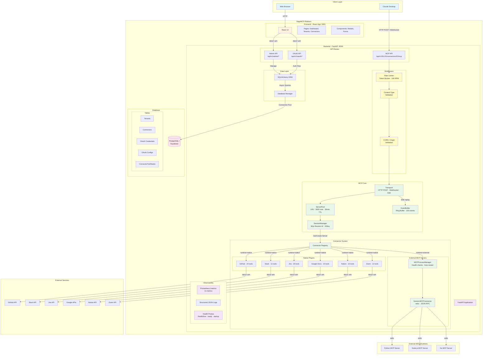
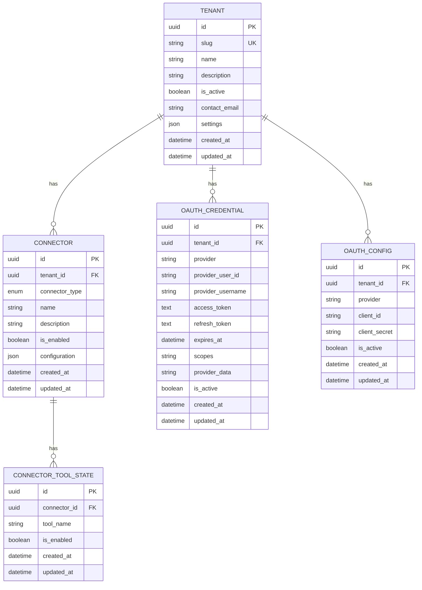
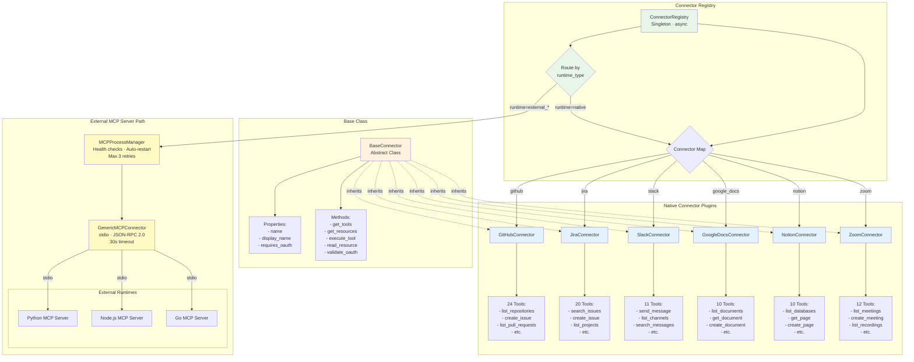

# SageMCP Architecture

## High-Level System Architecture

## Multi-Tenant Architecture

## OAuth Authentication Flow

## MCP Tool Execution Flow

## Database Schema

## Connector Plugin Architecture

## Request Flow: Creating and Using a Connector

## MCP Request Lifecycle (v2 — Streamable HTTP)

## Technology Stack

## Deployment Architecture

## Key Design Patterns

### 1. **Plugin Architecture**
- Connectors are dynamically registered via decorators
- All connectors inherit from `BaseConnector` abstract class
- Registry pattern for connector discovery and instantiation

### 2. **Multi-Tenancy**
- Path-based tenant isolation (`/api/v1/{tenant_slug}`)
- Foreign key relationships ensure data segregation
- Each tenant has isolated OAuth credentials and connectors

### 3. **Repository Pattern**
- SQLAlchemy ORM abstracts database operations
- Async database access via `asyncpg`
- Connection pooling for performance

### 4. **Factory Pattern**
- `MCPServer` factory creates server instances (now cached via `ServerPool`)
- Connector factory creates connector instances from registry

### 5. **Object Pool Pattern**
- `ServerPool` caches `MCPServer` instances keyed by `tenant_slug:connector_id`
- LRU eviction when pool exceeds `max_size` (default 5,000)
- TTL-based expiry (default 30 minutes) with background reaper (60s interval)

### 6. **Token Bucket Pattern**
- Per-tenant rate limiting with configurable RPM (default 100)
- Refill rate: `rpm / 60` tokens per second; burst capacity equals RPM
- Returns `429 Too Many Requests` with `Retry-After` header

### 7. **Ring Buffer Pattern**
- `EventBuffer` stores last 100 SSE events per session using `OrderedDict`
- FIFO eviction when capacity exceeded
- Supports `Last-Event-ID` header for resumable SSE streams

### 8. **Single-Flight Pattern**
- `SessionManager` ensures only one session is created per concurrent `initialize` request
- Max 10 sessions per tenant+connector key; oldest evicted when limit reached

### 9. **Decorator Pattern**
- `@register_connector` decorator for plugin registration
- FastAPI route decorators for API endpoints

### 10. **Adapter Pattern**
- Connectors adapt external APIs to MCP protocol
- `GenericMCPConnector` adapts stdio-based external MCP servers to the same interface
- Each connector translates between MCP tools and provider-specific APIs

## Security Architecture

```mermaid
graph TB
    subgraph "Security Layers"
        subgraph "Network Security"
            HTTPS[HTTPS/TLS]
            CORS[CORS Middleware]
        end

        subgraph "v2: Request Validation"
            RATE_LIM["Rate Limiting
Token bucket · per-tenant"]
            ORIGIN_VAL["Origin Validation
MCP_ALLOWED_ORIGINS"]
            CT_VAL["Content-Type Validation
application/json required"]
            SESS_BIND["Session Binding
Mcp-Session-Id"]
        end

        subgraph "Authentication"
            OAUTH[OAuth 2.0 Flow]
            JWT["JWT Tokens
Optional"]
            STATE["State Token
CSRF Protection"]
        end

        subgraph "Authorization"
            TENANT_ISO["Tenant Isolation
Path-based"]
            FK_CHECK["Foreign Key
Constraints"]
        end

        subgraph "Data Protection"
            TOKEN_ENC["Token Encryption
at rest"]
            SECRET_MGR["Secret Management
K8s Secrets/Vault"]
            ENV_VAR[Environment Variables]
        end

        subgraph "Input Validation"
            PYDANTIC[Pydantic Models]
            SQL_PREVENT["SQLAlchemy ORM
SQL Injection Prevention"]
        end
    end

    HTTPS --> RATE_LIM
    CORS --> ORIGIN_VAL
    RATE_LIM --> CT_VAL
    ORIGIN_VAL --> CT_VAL
    CT_VAL --> SESS_BIND
    SESS_BIND --> OAUTH
    OAUTH --> STATE
    STATE --> TENANT_ISO
    TENANT_ISO --> FK_CHECK
    FK_CHECK --> TOKEN_ENC
    TOKEN_ENC --> SECRET_MGR
    SECRET_MGR --> ENV_VAR
    ENV_VAR --> PYDANTIC
    PYDANTIC --> SQL_PREVENT
```

**v2 Security Additions:**
- **Rate limiting** — Token-bucket rate limiter prevents abuse; configurable per-tenant RPM with `Retry-After` headers
- **Origin validation** — `MCP_ALLOWED_ORIGINS` env var restricts which origins can send MCP requests
- **Content-Type enforcement** — Only `application/json` accepted for MCP HTTP POST endpoints
- **Session binding** — `Mcp-Session-Id` binds a client to a specific server instance, preventing session hijacking
- **CORS hardening** — `Mcp-Session-Id` added to `Access-Control-Expose-Headers` for cross-origin clients

## Performance Considerations

### Server Pool
- **Hit cost**: O(1) dict lookup + LRU touch (~0.01ms)
- **Miss cost**: DB query + connector instantiation (~5-15ms)
- **Eviction**: LRU when pool exceeds 5,000 entries; TTL reaper every 60s
- **Memory**: ~5KB per cached `MCPServer` instance

### Connection Reuse
- **HTTPX**: Async connection pool for external API calls (per-connector)
- **Subprocess persistence**: `MCPProcessManager` keeps external MCP server processes alive with 30s health checks
- **SQLAlchemy**: Async engine with connection pool (default: 5-20 connections)

### Session Management
- **Lookup cost**: O(1) dict access by `session_id`
- **Per-key limit**: Max 10 sessions per `tenant_slug:connector_id` (oldest evicted)
- **TTL**: 30-minute inactivity timeout with 60s background reaper

### Memory Budget (estimated at 3,000 active instances)

| Component | Per-Unit | At Scale | Notes |
|-----------|----------|----------|-------|
| ServerPool entries | ~5KB | ~15MB | 3,000 cached servers |
| SessionManager entries | ~2KB | ~6MB | 3,000 active sessions |
| EventBuffers | ~10KB | ~30MB | 100 events × 100 bytes × 3,000 sessions |
| External processes | ~20MB | ~200MB | Depends on server count |
| **Total (in-process)** | — | **~250MB** | Excluding external runtimes |

## Monitoring & Observability

### Prometheus Metrics

All metrics are prefixed with `sagemcp_` and exposed at `/metrics` (requires `SAGEMCP_ENABLE_METRICS=true`).

**Request Metrics:**

| Metric | Type | Labels | Description |
|--------|------|--------|-------------|
| `sagemcp_http_request_duration_seconds` | Histogram | `method`, `path_template`, `status_code` | HTTP request latency |
| `sagemcp_tool_call_duration_seconds` | Histogram | `connector_type`, `tool_name`, `status` | Tool execution latency |
| `sagemcp_tool_calls_total` | Counter | `connector_type`, `status` | Total tool invocations |

**Resource Gauges:**

| Metric | Type | Labels | Description |
|--------|------|--------|-------------|
| `sagemcp_active_sessions` | Gauge | — | Active MCP sessions |
| `sagemcp_pool_size` | Gauge | — | Server pool entries |
| `sagemcp_external_processes` | Gauge | — | Running external MCP processes |
| `sagemcp_memory_usage_bytes` | Gauge | `component` | Memory usage by component |

**Pool Metrics:**

| Metric | Type | Labels | Description |
|--------|------|--------|-------------|
| `sagemcp_pool_hits_total` | Counter | — | Server pool cache hits |
| `sagemcp_pool_misses_total` | Counter | — | Server pool cache misses |

> **Cardinality note:** `path_template` uses route templates (e.g., `/api/v1/{tenant_slug}/connectors/{connector_id}/mcp`), not raw paths, to keep cardinality bounded.

### Structured Logging

All log entries are JSON-formatted with the following fields:
- `timestamp`, `level`, `message` — Standard fields
- `tenant_slug`, `connector_id` — Request context
- `request_id` — Correlation ID for distributed tracing
- `duration_ms` — Operation timing

### Health Probes

| Endpoint | K8s Probe Type | Checks |
|----------|---------------|--------|
| `/health/live` | `livenessProbe` | Process is running |
| `/health/ready` | `readinessProbe` | DB reachable, pool initialized |
| `/health/startup` | `startupProbe` | Migrations complete, connectors registered |

---

## Summary

SageMCP is a **multi-tenant MCP server platform** that enables Claude Desktop to connect to external services via OAuth-authenticated connectors. The v2 architecture provides:

- **Pooled instances** — `ServerPool` caches up to 5,000 `MCPServer` instances with LRU eviction and 30-min TTL
- **Session management** — `Mcp-Session-Id` tracking with `EventBuffer` ring buffers for resumable SSE streams
- **Rate limiting** — Per-tenant token-bucket rate limiter (configurable RPM) with `Retry-After` headers
- **Observability** — 11 Prometheus metrics, structured JSON logging, and Kubernetes health probes (`/health/live|ready|startup`)
- **External MCP hosting** — `MCPProcessManager` runs third-party MCP servers as stdio subprocesses with health checks and auto-restart
- **Progressive rollout** — Feature flags (`SAGEMCP_ENABLE_*`) for safe, incremental v2 adoption
- **Protocol compliance** — Supports MCP protocol versions `2025-06-18` and `2024-11-05` with version negotiation

The platform bridges Claude Desktop's MCP protocol with external service APIs (GitHub, Slack, Jira, Google Docs, Notion, Zoom) and any MCP-compatible server through a unified, tenant-aware, production-hardened interface.
